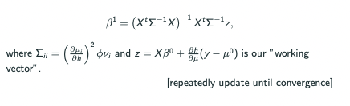
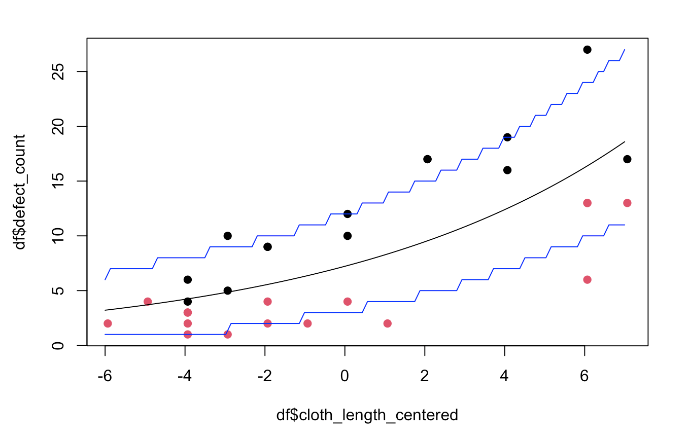
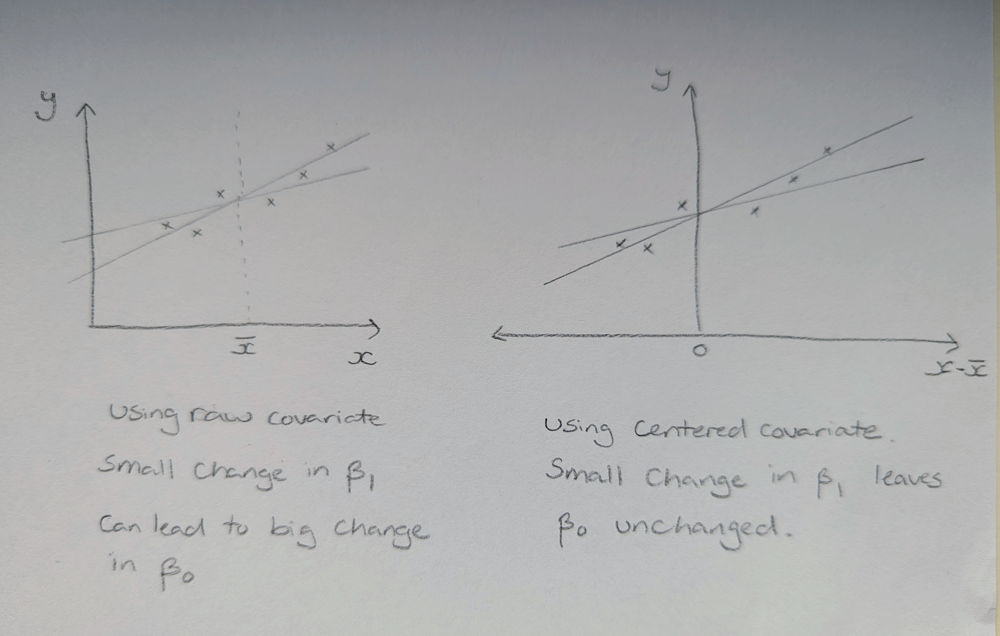

# GLMs

--------------------------------------------------------------------------------

## IRWLS  

### Question

Hi!

I have two questions related to the IRWLS method (and another unrelated question):

1) The picture below is a screenshot of the slides 

```{r irwls-question-maths, fig.cap='Exerpt from lecture slides', out.width='80%', fig.align='center', fig.alt='Exerpt from lecture slides.', echo = FALSE}

```

I have written down the equation and in my results $\Sigma_{ii}$ follows the formula below (the reciprocal of the slides): 

$$ \Sigma_{ii}=\left(\frac{\partial h}{\partial\mu_i}\right)^2\phi\nu_i $$
I have repeated the calculation multiple times but keep getting the same derivative. Would you mind checking whether this is correct?

2) After manually calculating the Poisson regression as requested in the lab, I have re-implemented IRWLS method for the Bernoulli distribution (doing all the steps, calculating the derivatives and iterating to find the $\beta$s). I also checked the results and they match those given by `glm`  in R for `family=binomial(link="logit")`. Is there a historical reason (or any other reason) why `glm` refers to this type of regression as "binomial" instead of "bernoulli"?

3) Do you have any recommendation for a good reference (or even a blog post) where to read something more about the difference between confidence and prediction intervals? 

Thank you in advance. 

### Response  

1. you are absolutely correct - this is a typo in the slides and should be the partial of $h$ with respect to $\mu_i$. Apologies for not spotting that while presenting or editing! 

2. the Bernoulli(p) distribution is a special case of the Binomial(n, p) distribution where $n=1$. The R function deals with the more general case of a Binomial GLM. By assuming that the user knows this relationship, the programmer does not need to implement, debug and maintain a whole other function just for the special case of Bernoulli regression (which using the default link is a logistic regression). 

3. I don't have a good source to hand but will have a look and try to get back to you later in the week. 

The general idea is that a confidence interval describes our uncertainty about model parameters under a given model. A prediction interval, on the other hand, describes our uncertainty about a future outcome. 

### Follow-up Question 

Thanks very much for the answers! They help a lot!

Regarding point 3, I would think then something like this should allow for the calculation of the prediction intervals (please correct me if I make any mistakes).

Step 1) Fit model to data set -> `model_1`

Step 2) Sample from the multivariate normal distribution of the parameters (classic monte carlo for CIs)

Step 3) From Step 2) we obtain a point estimate $\hat{\lambda}$ for the mean response of Poisson distribution. For each point estimate, we sample $n$ times from the Poisson having as first moment the values in Step 2

Step 4) We take the 5% and 95% quantiles to build the upper and lower bounds of the prediction intervals. 

As you explained, the prediction intervals should be "larger" than the confidence intervals as the latter do not take into account the variability in the responses. I am getting something like: 

```{r irwls-question-conf-int, fig.cap='Confidence Interval Plot', out.width='80%', fig.align='center', fig.alt='Confidence Interval Plot.', echo = FALSE}
knitr::include_graphics("img/05-glm/IRWLS_question_img_2.png")
```

For the 95% confidence interval of the model and: 

```{r irwls-question-pred-int, fig.cap='Prediction Interval Plot', out.width='80%', fig.align='center', fig.alt='Prediction Interval Plot.', echo = FALSE}

``` 

For the prediction intervals. I am a bit concerned about the fact that so many points lie outside the prediction interval though. Is the procedure I have described flawed?

### Follow-Up Response
This uncertainty is going to have two sources. Firstly, that the outcomes are inherently stochastic (e.g are Poisson distributed) so even if we knew the true model parameters there would be variation in the new value we are trying to predict. Secondly, we don't know those parameters for sure, we have had to estimate them. A prediction interval should account for both of these sources of uncertainty. This often requires the use of simulation to construct monte-carlo prediction intervals.  

(Note: we also have uncertainty about whether that Poisson model we are assuming is correct, but let's not worry about that now.) 

I hope that helps - I'm happy to go into more detail in the live sessions later this week. 


At a high-level this seems to be correct, there are just a few things I wanted to comment on. 

- A small, technical point. Although you can simulate n values of y for each lambda estimate, you only actually need to take 1. This is a little unintuitive but is essentially because in a prediction interval we are interested in the combination of parameter uncertainty and sampling variability of the new observation. It therefore makes better use of our computational budget to push more samples all the way through than to repeatedly simulate using the same estimated lambda values. 

- It does not in general make sense to compare the widths of CIs and prediction intervals in this way, since our parameters and outcomes are not usually on the same scale (though for a Poisson they are). You are on to the right idea here though, that a confidence interval for the expected value of a new outcome is going to be narrower than a prediction interval for that new outcome. (There is also the similar point, unrelated, point to make here that prediction intervals including parameter uncertainty are wider than those assuming that the point estimate is correct.)

- You are right to be concerned that so many point lie outside the prediction interval this suggests that there is some additional source of variability in our data that we are not modelling. (Hopefully that is enough of a hint to get you started in the right direction!)

--------------------------------------------------------------------------------

## Centering Predictors in GLMs 

### Question 

In the last video from this week, in pre-processing the cloth data, why did you center the predictor cloth length? Is it purely for ease of interpretation of the parameters later on or is there something else that I missed? 


### Response 

There are a couple of reasons (I'm sure there are more, but let's stick with the main two). 

Firstly, yes ease of interpreteation is important here - if we did not center cloth length then $\exp(\beta_0)$ would have the interpretation of the expected number of defects in a cloth of length 0m. Using the centered length it gives us the expected number of of defects in a cloth of average length, something we actually care about. (I mention this in the lab solutions)

Secondly, it makes our inference process easier. Centering the predictor helps to separate or "orthogonalise" the effects slope and intercept parameters, thereby reducing the covariance between the corresponding parameter estimates. This reduces how much our uncertainty in one parameter changes based on the estimated value of the other parameter. When parameters a re fully orthogonal, our uncertainty in  one is not effected at all by the value of the other. 

In terms of the variance matrix $\text{Var}(\mathbf{\beta})$, this centering of the covariate reduces the size of the off-diagonal terms. This means that our uncertainty about the slope does not impact our uncertainty about the intercept quite so much, and vice-versa. The benefits of this can be seen most clearly if we consider the variance of our estimated linear predictor for a cloth of length $a$: 

$$\text{Var}(\hat \beta_0 + a \hat \beta_1) = \text{Var}(\hat \beta_0) + a^2 \text{Var}(\hat \beta_2) + 2a \text{Cov}(\hat \beta_0, \hat \beta_1)$$

This is going to be smaller if we can use a centered covariate so that there is less dependence between the parameter estimates. 

### Follow-up Question 

Thanks. However, I'm not sure if I understand the second point that you are making. Can you elaborate what exactly you mean by "centering the predictor helps to separate or orthogonalise the effects slope and intercept parameters"? Am I right to say that with a centered predictor, since the intercept (exp of) is the expected value of $y$ at the average $x$, the variance is at its smallest, and is almost independent of the slope?

Moreover, centering is not a required step but rather a convenient "nice-to-have", yes?


### Follow-up Response 

Yes, you are right to say that centered predictor makes $\hat \beta_0$ and $\hat \beta_1$ almost independent (or at least less dependent than when using the raw covariate). 

You can see this more clearly for linear regression in the diagram below. If our covariate takes large values then even a small change in slope will lead to a large change in intercept when using the raw covariate. When using the centered version of the covariate this dependence is much reduced.

```{r centering-diagram, fig.cap='Schematic plot showing the effect of centering on the dependence between parameter estimates.', out.width='80%', fig.align='center', fig.alt='Schematic plot showing the effect of centering on the dependence between parameter estimates.', echo = FALSE}

``` 


