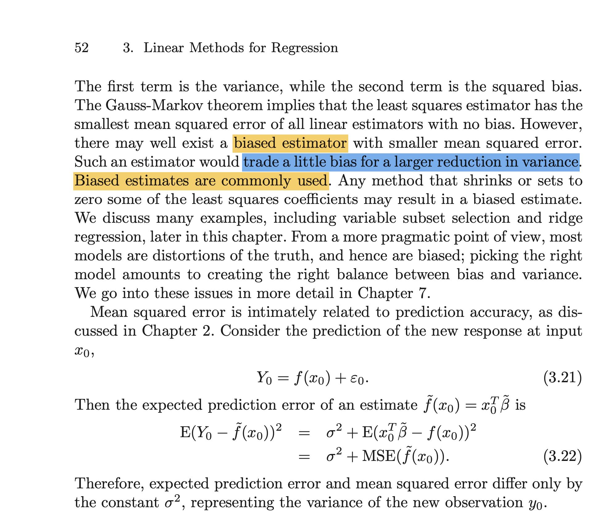

# Linear Regression 

Questions relating to Week 2: Linear Regression.

--------------------------------------------------------------------------------

## Residual Variance Denominator 


### Question 

I found that in literature the residual standard error takes the form of either:

$$ \hat \sigma^2 = \sqrt{\frac{\text{RSS}}{n - p}}$$ 

or 

$$ \hat \sigma = \sqrt{\frac{\text{RSS}}{n - p - 1}}$$

In particular, the first one was introduced in Chris' video whereas the second is Eq. 3.25 of ISLR.

Now, I noticed the $F$-statistic also uses $(n-p-1)$ so I used the latter for the lab, but I was wondering whether somebody could explain this difference and whether it is relevant even with $n>>30$.


### Response

The reason for the difference with ISLR is just cosmetic: they include the intercept as a separate parameter:$(\beta_0, \beta_1, \ldots, \beta_p)$  gives $p+1$ parameters. In the notes, we treat the intercept just like any other parameter, corresponding to the first column of the design matrix. This means we have $p$ parameters. 

A different point, and not what is going on here, is the fact that often the maximum likelihood estimator of a variance parameter is biased, and in some applications an unbiased estimator is preferred. e.g. if we have 

$$ X_1,\ldots, X_n \sim N(\mu, \sigma^2)$$

then the maximum likelihood estimator for the variance is 

$$ \frac{1}{n} \sum_{i = 1}^{n} (X_i - \bar X)^2,$$

but for an unbiased estimator - one that is right in expectation - we need 

$$ \frac{1}{n-1} \sum_{i = 1}^{n} (X_i - \bar X)^2,$$


Generally if your sample is small enough that these are materially different, you probably have bigger things to worry about. But this is ultimately related to the bias-variance trade-off we have discussed. 

--------------------------------------------------------------------------

## Lab 2 Differentiation

### Question 

Lab 2, Section 1.2, I understand that for the purpose of finding the stationary points of the gradient the sign is not relevant, but shouldn't there be a - before the 2  in the equation below? 

$$ \nabla S(\beta) = 2 X^T(y - X\beta) = 0.$$


### Response

Thanks for this, yes you are right! 

--------------------------------------------------------------------------

## Unbiasedness of Least Squares Regression

### Question 

During reading the textbook (ESL page 52) about linear regression I encountered an interesting point: the Gauss-Markov brings the good property of BLUE for Least Squares estimate, yet it seems to be not the best linear model choice for practical prediction task due to bias variance tradeoff. (Figure \@ref(fig:esl-lsr-quote)) 

<div class="figure" style="text-align: center">

<p class="caption">(\#fig:esl-lsr-quote)Exerpt from Elements of Satistical Learning</p>
</div>

I understand that when the data are noisy (i.e., break some of the Gauss-Markov assumptions), Least Squares may overfit and do not perform well with high variance. 

However, my question is that does this argument imply that when the data are in good quality (e.g. comply with the required assumptions), Least Squares estimate may still not perform well out-of-sample due to high variance? 

Overall, it seems the supervised leaning shrugs off the unbiasedness property. What is the practical value to be an **unbiased** estimator? Is it all for the inference purpose?


### Response

I will try to address your questions in reverse order. 

Using an unbiased estimator is often a good thing to because it gives us the assurance that if we were to collect larger and larger data sets (assuming our true data generating process can be represented by our chosen class of models), then our parameter estimates would converge to the true values. This is clearly a good property for our estimator to have.

However, if we inisit that our estimators must be unbiased then we are restricting ourselves in some way. By allowing some small amount of bias we may be able to make better predictions but this comes at the cost of knowing that as we collect more and more data we would not uncover the true data generating process with our model (even if it can be represented in our model class).

-------------------------------------------------------------------------

## Linear Regression Assumptions 


### Question 

Hi, to better understand the linear regression residual diagnosis, during the study of textbook and lab materials I collect some mentioned assumptions and get some follow-up questions. Look forward to answers, thanks a lot!

Below are the listed assumptions in the order of importance: 

1. Linear additive true mode exists between $Y$ and $X$, $X$ is non-random and identifiable (this may be trivial, more as formulation); 1. Zero expected mean of error terms; 
1. Constant variance of errors;  
1. Errors are uncorrelated to each other;
1. Errors are i.i.d.; 
1. Errors are normally distributed; 
1. Features should not be highly multi-collinear (this is not a mandatory assumption).    

First of all, to make the least squares to be unbiased estimator (based on the derivation in Lab 2), it seems we only need assumption 1 and 2? 

Next, assumptions 1+2+3+4 are good enough to make the least squares to be BLUE. Then what about the value of **assumptions 5 and 6**? ISLR textbook seems to allude to the statistical inference purpose, however, based on the Central Limit Theorem, won't the Normality assumption 6 look unnecessary apart from sample efficiency? It looks like only the property that least squares is MLE introduced in Lab2 requires all the assumptions 1 to 6.

Lastly, the **multi-collinearity** issue increases the standard error of coefficient for correlated features, thus harming the statistical inference (according to ISLR), yet the model is still unbiased and BLUE/MLE so long as other assumptions hold. How will multi-collinearity impact the **prediction** then? It will potentially increase the prediction variance and so can harm the overall prediction ability (i.e. MSE) as well?


### Response 

For your first question. Yes, only 1 and 2 are required: to see this we can to show that $\mathbb{E}[\hat \beta_i] = \beta_i$ for all coefficients. 

For your second question, 2-4 put assumptions on the first two moments of the errors but they may have different distributions that achieve these equal moments. In 5 and 6 we are additionally assuming that the entire distribution of the errors are equal and that this distribution is a Gaussian distribution. Without these assumptions we know that the parameter estimates (and therefore predictions) have a sampling distribution that is also Gaussian in the limit as n becomes large, but for finite sample sizes we don't know the distribution. We then use the CLT to motivate a Gaussian approximation of this unknown distribution. By making these additional assumptions, we don't have to make an approximation: the sampling distribution is exactly Gaussian  for finite sample sizes as well as being true in the limit.

For your final question, you have gone most of the way to an answer yourself. If including colinear predictors in our model increases the standard errors of the parameter estimates then it will also increase the standard errors of our predictions, since these are simply a linear combination of the estimated parameters. 

--------------------------------------------------------------------------------


<!-- There are two steps to cross-reference any heading:

1. Label the heading: `# Hello world {#nice-label}`. 
    - Leave the label off if you like the automated heading generated based on your heading title: for example, `# Hello world` = `# Hello world {#hello-world}`.
    - To label an un-numbered heading, use: `# Hello world {-#nice-label}` or `{# Hello world .unnumbered}`.

1. Next, reference the labeled heading anywhere in the text using `\@ref(nice-label)`; for example, please see Chapter \@ref(cross). 
    - If you prefer text as the link instead of a numbered reference use: [any text you want can go here](#cross).

## Captioned figures and tables

Figures and tables *with captions* can also be cross-referenced from elsewhere in your book using `\@ref(fig:chunk-label)` and `\@ref(tag:chunk-label)`, respectively.

See Figure \@ref(fig:nice-fig).


```r
par(mar = c(4, 4, .1, .1))
plot(pressure, type = 'b', pch = 19)
```

<div class="figure" style="text-align: center">

<p class="caption">(\#fig:nice-fig)Here is a nice figure!</p>
</div>

Don't miss Table \@ref(tab:nice-tab).


```r
knitr::kable(
  head(pressure, 10), caption = 'Here is a nice table!',
  booktabs = TRUE
)
```


Table: (\#tab:nice-tab)Here is a nice table!

| temperature| pressure|
|-----------:|--------:|
|           0|   0.0002|
|          20|   0.0012|
|          40|   0.0060|
|          60|   0.0300|
|          80|   0.0900|
|         100|   0.2700|
|         120|   0.7500|
|         140|   1.8500|
|         160|   4.2000|
|         180|   8.8000|
--> 
